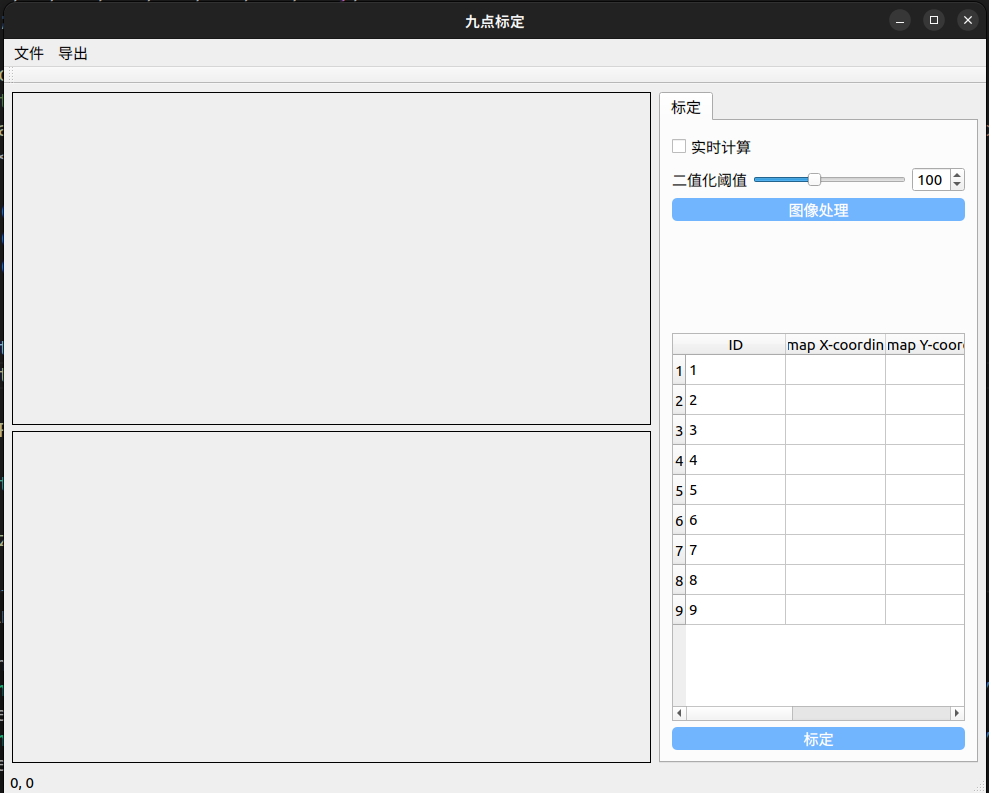
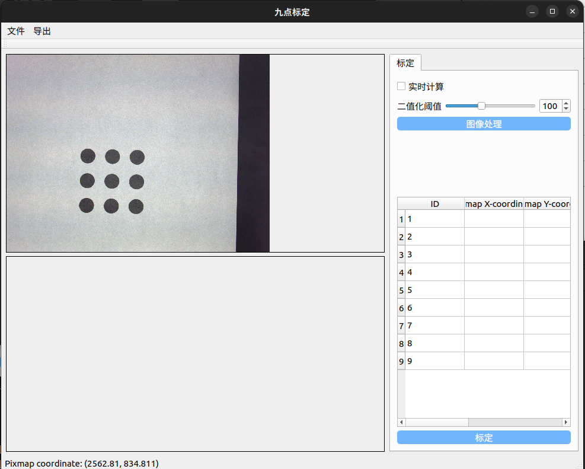
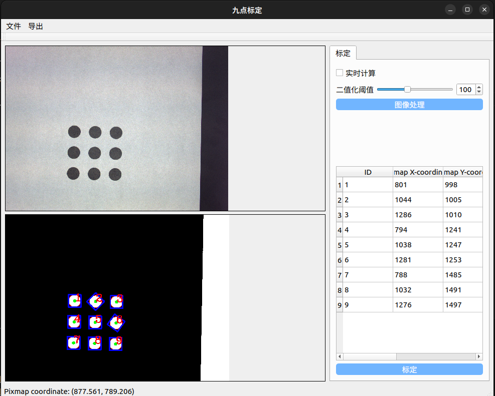
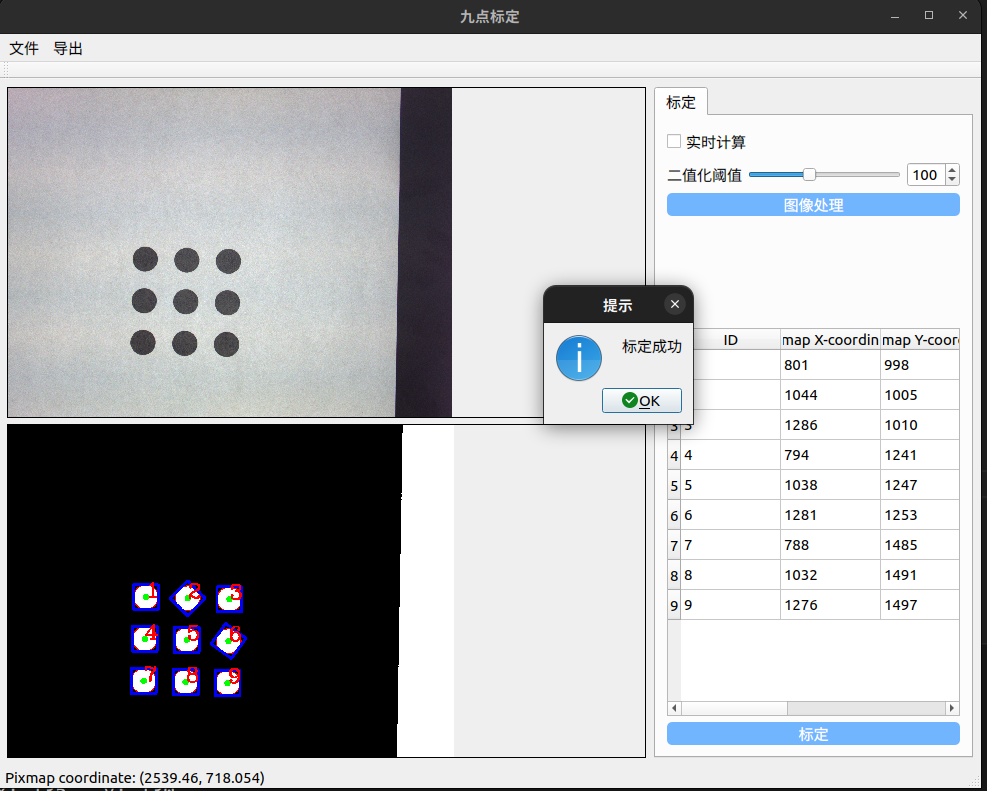

# nine-point-calibration

本项目的功能为实现机器人抓取中的九点标定，并导出标定结果

## 功能

 - [x] 九点标定
 - [x] 导出标定结果

## 依赖
- OpenCV (建议4.5.5版本)
- Qt (建议5.12.12版本)
- CMake (3.5以上版本)

## 安装
- 下载本库
- Linux 在项目目录下打开终端并输入以下命令
``` shell
  mkdir build && cd build
  cmake .. && make -j
```
- Windows则需配合VS来完成编译

- 编译完后点击生成的可执行文件即可

##使用


 - 点击左上角的文件，然后点击打开文件，选择标定用的标定板图片

 - 在二值化阈值处选择好合适的阈值后点击图像处理，即可对标定图像进行二值化处理并寻找九点的位置
 - 若勾选实时计算，怎会在每次二值化阈值改变时进行新的图像处理

 - 当确认九点的位置没有问题后，点击右下角的标定按钮完成标定

 - 最后点击左上角的导出然后点击导出标定数据，即可将标定数据导出到calib_info.calib中

- 至此整个标定过程完成